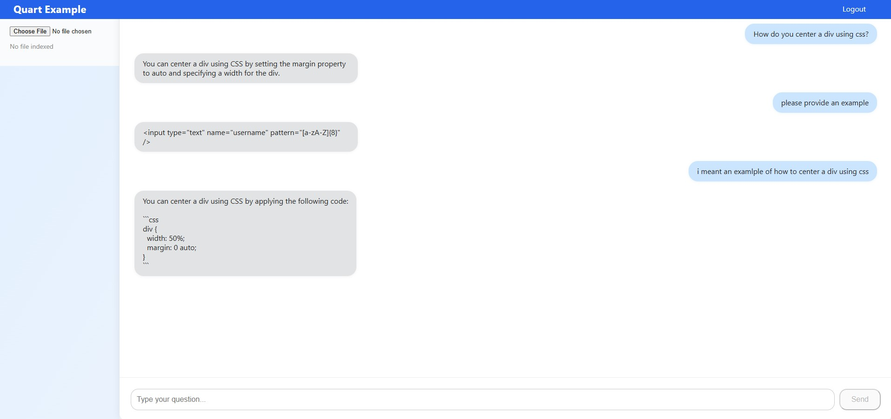

# Quart Example App – Blue Edge

## Project Overview

- **Backend:** Quart (Python 3.12)
- **Frontend:** Vite + React (TypeScript)
- **Style:** FluentUI/react-components (v9 preferred)

**Note:**  
- Do not use inline styles; always use `.css` files.

---

## Description

This is a simple example of a RAG (Retrieval-Augmented Generation) chatbot where users can upload documents and ask questions about their content. The application uses OpenAI's API for processing and generating responses. The login is mocked.

To use the application:
1. Get an OpenAI API key from [platform.openai.com](https://platform.openai.com)
2. Rename `.env.example` to `.env`
3. Add your OpenAI API key to the `.env` file

---

## Screenshot



---

## Resources

- [Vite Documentation](https://vite.dev/guide/)
- [React Documentation](https://react.dev/learn)
- [TypeScript Documentation](https://www.typescriptlang.org/docs/)
- [FluentUI Quick Start](https://react.fluentui.dev/?path=/docs/concepts-developer-quick-start--docs)
- [FluentUI Icons Catalog](https://react.fluentui.dev/?path=/docs/icons-catalog--docs)

> There are two versions of FluentUI:  
> - v8: `fluentui/react`  
> - v9: `fluentui/react-components` (preferred for new work)  
> We are migrating to v9, but you may see some older imports.

---

## General Info

- The project contains both frontend and backend under the `app` directory.
- During development, the frontend is served separately.
- Running `npm run build` in the frontend outputs static files to `app/backend/static`.
- When deploying (e.g., to Azure), only the backend folder is used.

---

## Requirements

- **Python 3.12**  
  _If you're on Windows, you can install it for free from the Windows Store._
- **Node.js (18.x or newer recommended)**  
  _Download from [nodejs.org](https://nodejs.org/) (includes npm)._
- **Git**  
  _Download from [git-scm.com](https://git-scm.com/)_
- **(Recommended) Visual Studio Code**  
  _Download from [code.visualstudio.com](https://code.visualstudio.com/)_

---

## Getting Started

### 1. Clone the Repository

```sh
git clone https://github.com/axemanks/quart-example-app-blue-edge.git
cd quart-example-app-blue-edge
```
> _If you want to clone into the current directory instead of creating a new folder, add a space and a dot after the URL._

### 2. Open in VS Code

```sh
code .
```
- Install the recommended extensions if prompted.

### 3. Set Up Python Virtual Environment

1. Open the command palette: <kbd>Ctrl</kbd> + <kbd>Shift</kbd> + <kbd>P</kbd>
2. Type `Python: Create Virtual Environment` and select it.
3. Choose **Venv**.
4. Select **Python 3.12.x**.
5. Check the box for `app/backend/requirements.txt` and click **OK**.

> This sets up a clean environment for Python packages, keeping dependencies isolated per project.

---

## Running the Backend

1. Start the backend server:

   ```sh
   cd app/backend
   quart run
   ```

   Or, use the **Run and Debug** icon in VS Code (the triangle with a bug).

2. When the backend starts, you should see:

   ```
   Running on http://127.0.0.1:8000 (CTRL + C to quit)
   ```

   - Click the link to open the app.
   - Note: You won't see frontend changes until you build the frontend.

---

## Running the Frontend (Development Mode)

1. In a new terminal, change directory:

   ```sh
   cd app/frontend
   ```

2. (First time only) Install dependencies:

   ```sh
   npm install
   ```

3. Start the development server:

   ```sh
   npm run dev
   ```

   - You should see:  
     `Local: http://localhost:5173`  
     (Press Ctrl+C to quit)

   - Hold Ctrl and click the link to open the frontend in your browser.

---

## Workflow

- Keep the frontend (Vite) and backend (Quart) running in separate terminals.
- This allows you to see live frontend changes and backend logs at the same time.
